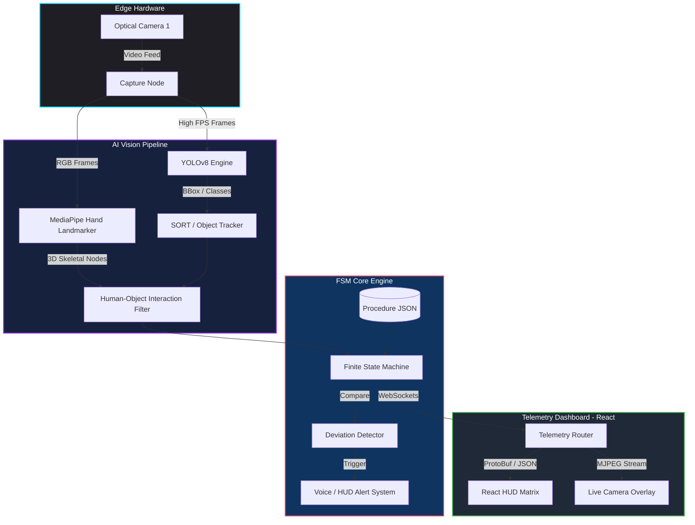

<div align="center">
  
  

  
  
  
  
  
  <br />
  <br />

  <p align="center">
    <a href="#-overview">Overview</a> •
    <a href="#-system-architecture">Architecture</a> •
    <a href="#-frontend-calibration--hud-features">Frontend</a> •
    <a href="#-backend--ai-capabilities">Backend</a> •
    <a href="#-telemetry--data-stream">Telemetry</a> •
    <a href="#-offline-deployment-guide">Deployment</a>
  </p>
</div>

<br/>

## 🌟 Overview
**A.T.L.A.S (Automated Telemetry & Logistics Analysis System)** is a highly robust, full-stack, AI-driven procedure monitoring system built for the **Smart India Hackathon (SIH)**. It ensures precision in complex, high-stakes tasks—such as scientific experiments, lunar soil titration, and hazardous material transfers—by acting as an intelligent auditing and telemetry agent.

In high-stakes environments like space exploration or medical cleanrooms, human error is not an option. A.T.L.A.S solves this by using real-time computer vision to continuously track hand movements, object manipulations, and kinematic states, guaranteeing that standard operating procedures (SOPs) are strictly followed step-by-step. Deviations are instantly flagged visually and with voice alerts, ensuring zero-error mission execution.

---

## 🏗️ System Architecture

A.T.L.A.S operates on a split Edge-Cloud architecture optimized for extreme low-latency visual tracking. It processes heavy machine learning inference on the edge node, whilst broadcasting lightweight Protocol Buffers (gRPC/Proto) to the React-based Telemetry HUD via WebSockets.



---

## 🎛️ Frontend Calibration & HUD Features

The A.T.L.A.S frontend is not just a standard web dashboard; it is a **Mission Control HUD** built with React, Vite, and TailwindCSS, utilizing cinematic typography (Orbitron & JetBrains Mono) to mimic aerospace interfaces. Before any mission begins, the system enforces a strict **Pre-Flight Hardware Lock**.

### 🔬 Pre-Flight Setup & Calibration Matrix
- **Optical Intrinsic Matrix:** Live verification of `camera_profile.npz`. Automatically calibrates Focal Length & Distortion Centers (`fx`, `fy`, `cx`).
- **Environmental Calibration Radar:** 
  - Real-time **Ambient Venue Lux** tracking with **Auto-CLAHE** priming to handle poor lighting conditions automatically.
  - **Optical Glare Saturation** monitoring via the proprietary **Glare Guardian** system.
- **PID Thermodynamic Baseline:** Live Edge Node Idle Temp and stable FPS tracking.
- **Mass Manifest Lock (FOD):** AI Vision must physically detect and verify all payload items in the camera view (e.g., *Lunar Regolith Sample, Titration Flask A, Reagent HCl*) before the State Machine unlocks the mission sequence.

### 🛰️ Live Mission HUD
- **Real-time MJPEG Decoding:** High-FPS, ultra-low latency optical stream parsing directly from the edge node.
- **AI Confidence Mocking:** Live telemetry charts reflecting the YOLOv8 and MediaPipe structural confidence metrics.
- **OVERDUE UI Matrix:** Dynamic SLA (Service Level Agreement) timers that warn the operator if a specific procedural step is taking longer than the standard baseline.
- **WebSocket Synchronization:** Instant state reconciliation between the Python backend FSM and the React UI.

---

## ✨ Backend & AI Capabilities

The backbone of A.T.L.A.S is written in Python (FastAPI) and handles rigorous real-time computations.

- 👁️ **Multi-Model Tracking**: Simultaneously runs `YOLOv8` for object detection and `MediaPipe` for 3D skeletal tracking.
- ⚙️ **Finite State Machine (FSM)**: Enforces procedural workflows defined in highly modular `JSON` configurations. Evaluates `start_conditions`, `end_conditions`, and `fail_conditions`.
- 📐 **Kinematic PnP Solving**: Measures precise spatial deviations and interaction angles in 3D space (using Perspective-n-Point and ORB feature matching).
- 🎙️ **Intelligent Voice Engine**: Delivers instant auditory feedback using text-to-speech when safety bounds are crossed (e.g., *"Warning: Hand detected without gloves"* or *"Incorrect Sequence: Step 3 executed before Step 2"*).

---

## 📡 Telemetry & Data Stream

To maintain extreme speed over local networks, A.T.L.A.S serializes complex kinematic data using **Protocol Buffers** (`telemetry.proto`). Here is an excerpt of the custom Telemetry frame sent to the HUD up to 30 times a second:

```protobuf
message TelemetryFrame {
    double timestamp = 1;
    FSMState fsm_state = 2;
    repeated Detection detections = 3;
    repeated Interaction interactions = 4;
    int32 latency_ms = 5;
    int32 fps = 6;
}

message Interaction {
    string class_name = 1;
    string state = 2; // e.g. "FAR", "NEAR", "HELD"
    float distance_mm = 3;
}
```

---

## 🛠️ Tech Stack

<div align="center">
  <a href="https://skillicons.dev">
    
  </a>
</div>

<br/>

**Core Deep Learning Models (Included Offline):**
- Ultralytics YOLOv8 Nano (`yolov8n.pt`)
- Google MediaPipe Hand Landmarker (`hand_landmarker.task`)

---

## 🚀 Offline Deployment Guide

For SIH presentations, reliable offline capability is critical. A.T.L.A.S is designed to run entirely locally without external API dependencies. All base ML models are included in this repository.

<details>
<summary><b>1. Environment Preparation (Click to Expand)</b></summary>

Ensure you have the following installed on your edge node or presentation laptop:
- **Python 3.10+** (With `pip` and `venv`)
- **Node.js 18+** & `npm`
- A connected USB Webcam or integrated camera.
- Mac, Linux, or Windows (via WSL/Git Bash).
</details>

<details>
<summary><b>2. Backend (Edge Node) Offline Setup</b></summary>

The backend powers the heavy lifting (YOLO, MediaPipe, FSM, and FastAPI WebSocket server).

```bash
# Navigate to the backend directory
cd bas-apg-backend

# Create a virtual environment and install dependencies
python3 -m venv venv
source venv/bin/activate
pip install -r requirements.txt

# Start the vision engine and telemetry server
# Note: Models are already bundled locally! No downloads required.
./launch_edge_node.sh
```
*(The backend runs on `localhost:8000`)*
</details>

<details>
<summary><b>3. Frontend (Telemetry HUD) Offline Setup</b></summary>

The frontend operates locally using Vite and connects to the backend WebSockets.

```bash
# Navigate to the frontend directory
cd bas-apg-frontend

# Install Node dependencies (Requires internet only for the first installation)
npm install

# Start the Vite development server
npm run dev
```
*(The frontend runs on `localhost:5173`)*
</details>

<details>
<summary><b>4. One-Click Launch (macOS/Linux)</b></summary>

For rapid presentation recovery, use the bundled concurrent startup script. It will open separate terminal windows for the frontend and backend, instantly bringing the system online:

```bash
chmod +x launch_demo.sh
./launch_demo.sh
```
</details>

---

## 🚨 Troubleshooting

- **Webcam Access Denied:** Ensure your terminal/IDE has Camera Privacy Permissions enabled (especially on macOS).
- **Port Conflicts:** Ensure ports `8000` (FastAPI) and `5173` (Vite) are not in use by other services.
- **Low FPS:** If running on a system without a dedicated GPU, YOLOv8 will fall back to CPU. The `yolov8n.pt` model is highly optimized, but closing background applications will improve frame rates.

---

## 📸 Working Images / Dashboards

Below are live captures of the A.T.L.A.S system in action across the different operational dashboards:

### Setup & Diagnostics


### Station Telemetry


### Mission Control & Live Feed


### Audit & Telemetry Logs


### Training Suite & Object Registration


### Local Data Logging & Native Apps


---

<div align="center">
  
</div>
