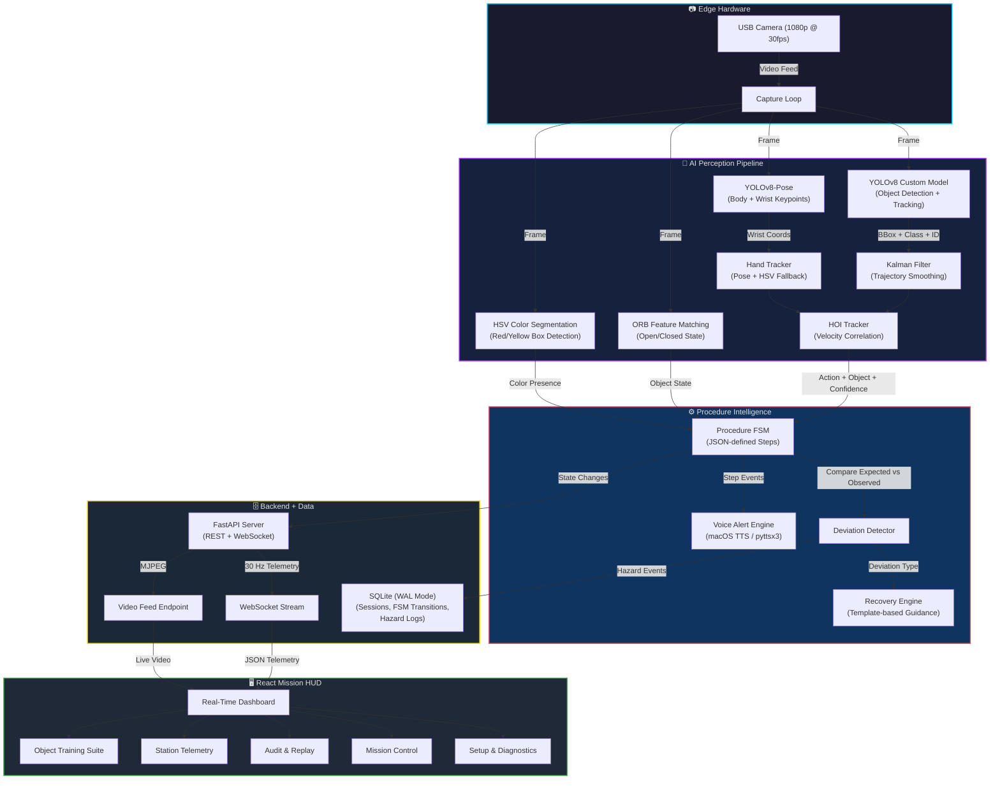

<div align="center">

# 🚀 A.T.L.A.S.

### **Aerospace Task Logging & Assistance System**

<br/>

> **An offline-first AI perception and procedure-verification system for real-time monitoring,
> deviation detection, and operator assistance during structured onboard experiments.**

<br/>


<br/>
<br/>


<br/>
<br/>

<p>
  <a href="#-the-problem">Problem</a> •
  <a href="#-our-solution">Solution</a> •
  <a href="#-how-it-thinks">Pipeline</a> •
  <a href="#-system-architecture">Architecture</a> •
  <a href="#-technology-stack">Tech Stack</a> •
  <a href="#-quick-start">Quick Start</a> •
  <a href="#-screenshots">Screenshots</a> •
  <a href="#-future-roadmap">Roadmap</a>
</p>

</div>

---

<div align="center">

```
┌──────────────────────────────────────────────────────────────┐
│                        A.T.L.A.S.                            │
│          Aerospace Task Logging & Assistance System          │
├──────────────────────────────────────────────────────────────┤
│  SIH Problem Statement   │  SIH26174                        │
│  Organization            │  ISRO                            │
│  Track                   │  Software                        │
│  Domain                  │  AI Human Activity Recognition   │
│  Architecture            │  Edge / Offline-First             │
│  AI Core                 │  Computer Vision + FSM            │
│  Interface               │  Real-Time Mission Control HUD   │
│  Status                  │  Prototype / Development          │
└──────────────────────────────────────────────────────────────┘
```

</div>

---

## ⏱ If You Only Have 60 Seconds

```
A.T.L.A.S.
    │
    ▼
AI observes experiment via camera
    │
    ▼
Detects objects, tracks hands, understands interactions
    │
    ▼
Checks what the operator is doing against the expected procedure
    │
    ▼
Uses multiple evidence signals to verify each step
    │
    ▼
Detects deviations — wrong object, skipped step, wrong order
    │
    ▼
Provides voice alerts and recovery guidance
    │
    ▼
Logs every event for audit and replay
    │
    ▼
All of this runs locally — no internet required
```

---

## 🔭 The Problem

In high-stakes environments — onboard space laboratories, biological containment facilities, or precision experiment stations — operators perform **predefined, sequential procedures** where each step must be executed correctly, in order, with the right equipment.

**The challenge:**

| | |
|---|---|
| **Sequential Precision** | Steps must follow a strict order. Skipping, reordering, or using the wrong object can compromise the experiment or create safety hazards. |
| **Limited Oversight** | In remote or isolated environments, there may be no second operator to cross-check actions in real time. |
| **Passive Recording ≠ Understanding** | A camera recording captures video but does not *understand* what is happening — it cannot identify a wrong object, flag a skipped step, or tell the operator what to do next. |
| **Delayed Error Discovery** | Without real-time verification, procedural errors are often discovered only during post-experiment analysis — when it is too late to correct them. |

**What is needed** is not just a camera — it is a system that can **perceive** the workspace, **understand** what action is being performed, **verify** it against the expected procedure, **detect** deviations, and **assist** the operator in real time.

---

## 🧠 Our Solution

A.T.L.A.S. bridges the gap between passive observation and active procedure intelligence.

```
          OPERATOR
              │
              ▼
          📷 CAMERA
              │
              ▼
      🔭 AI PERCEPTION
     (Object Detection, Pose,
      Hand Tracking, HOI)
              │
              ▼
     🧠 ACTIVITY UNDERSTANDING
     (What action is happening?
      What object is involved?)
              │
              ▼
     ⚙️ PROCEDURE VERIFICATION
     (FSM compares observed vs expected)
              │
          ┌───┴───┐
          ▼       ▼
       ✅ CORRECT  ⚠️ DEVIATION
          │       │
          │       ▼
          │    🔄 RECOVERY GUIDANCE
          │       │
          └───┬───┘
              ▼
        📋 EVENT LOGGING
        (SQLite + Text Logs)
              │
              ▼
         🖥️ DASHBOARD
         (Real-Time HUD)
```

A.T.L.A.S. is designed as an **offline-first prototype** — the core AI perception, procedure engine, and operator interface all run locally without depending on cloud services or internet connectivity.

> **Note:** A.T.L.A.S. is a prototype developed for the Smart India Hackathon 2026. The demonstration procedure is a choreographed scenario designed to showcase the system's capabilities. It is not an actual ISRO/BAS flight procedure.

---

## 💡 Why A.T.L.A.S.?

<table>
<tr>
<td width="50%">

### 01 — Perception
Multi-model AI pipeline: YOLOv8 for object detection, YOLOv8-Pose for body/hand tracking, ORB feature matching for fine-grained object state recognition (open/closed containers), HSV color segmentation for environmental conditions.

### 02 — Human-Object Interaction
Goes beyond simple object detection. Velocity Correlation (Pearson's r) between hand and object motion determines whether an object is FAR, NEAR, or HELD — understanding *interaction*, not just presence.

### 03 — Procedure Awareness
A deterministic Finite State Machine (FSM) loaded from JSON procedure definitions enforces step sequencing with configurable confidence thresholds, timeouts, and recovery options.

### 04 — Evidence-Based Verification
Step confirmation requires multiple signals: object detection + hand presence + interaction state + temporal debounce + scene change analysis. No single-prediction blind trust.

</td>
<td width="50%">

### 05 — Deviation Detection
Classifies deviations by type:
- `WRONG_OBJECT` — correct action, wrong equipment
- `SKIPPED_STEP` — future step attempted before current
- `WRONG_ORDER` — steps performed out of sequence
- `INCOMPLETE_ACTION` — step timeout exceeded

### 06 — Recovery Guidance
Template-based, deterministic recovery instructions for both UI and voice. Recovery paths are predefined — never generated by AI/LLM at runtime.

### 07 — Offline / Edge Operation
Core runtime (camera → AI → FSM → voice → logging → dashboard) runs entirely on a local machine. No network calls during inference.

### 08 — Structured Logging
Every FSM transition, deviation, hazard event, and session is recorded in SQLite (WAL mode) and timestamped text logs for post-experiment audit.

</td>
</tr>
</table>

---

## 🔬 How It Thinks

This is the core reasoning chain that runs for **every frame**:

```
What does the camera see?
          │
          ▼
What objects are present?  ─── YOLOv8 custom-trained model
          │                     + ORB feature matching
          ▼                     + HSV color segmentation
Where is the operator's hand?  ─── YOLOv8-Pose wrist keypoints
          │                         + HSV skin fallback
          ▼
What is the hand-object relationship?  ─── Velocity Correlation
          │                                  (Pearson's r > 0.75 → HELD)
          ▼
What action is being performed?  ─── Interaction state + object identity
          │                           + Kalman-smoothed trajectory
          ▼
What action is expected?  ─── FSM current step definition
          │                    (from JSON procedure schema)
          ▼
Does the evidence support it?  ─── Object visible + hand present
          │                         + interaction confirmed
          │                         + scene changed from baseline
          │                         + temporal debounce (N consecutive frames)
          ▼
    ┌─────┴──────┐
    ▼            ▼
 ✅ MATCH     ⚠️ MISMATCH
    │            │
    ▼            ▼
 Advance FSM   Classify Deviation
    │            │
    ▼            ▼
 Voice ✓       Voice ⚠ + Recovery
    │            │
    └────┬───────┘
         ▼
   Log Event + Update Dashboard
```

---

## 🧪 A.T.L.A.S. in One Example

The default demonstration procedure is a **Red/Yellow Box Sample Transfer** — a multi-step experiment where the operator must detect, open, and interact with colored containers and tools in a specific order.

### Step: "Detect Red Box"

```
Camera captures frame
        ↓
HSV color segmentation confirms red hue in frame
        ↓
ORB feature matching NOT needed for DETECT (only for OPEN state)
        ↓
YOLOv8-Pose confirms operator hand is visible
        ↓
Scene-change analysis confirms frame differs from baseline
        ↓
Object + hand co-presence confirmed for 1.5 seconds
        ↓
FSM debounce counter reaches threshold (15 frames)
        ↓
Procedure expects step S02: DETECT red_box
        ↓
✅ STEP VERIFIED
        ↓
Voice: "Red box detection complete."
        ↓
FSM advances to S03: OPEN open_red_box
        ↓
Voice (after 1s delay): "Please open the red box."
        ↓
Event logged → Dashboard updated via WebSocket
```

---

## ⚠️ When Something Goes Wrong

### Deviation Example: Wrong Object

```
Expected step:
  S04 — DETECT hole_puncher

Operator shows:
  yellow_box (a future step's object)

            ↓

ORB/HSV detector identifies yellow_box
            ↓
FSM matches against future steps → S05 expects yellow_box
            ↓
Deviation classified: SKIPPED_STEP
            ↓
Voice alert: "Yellow box detected, this is a future step.
              Please show the hole puncher."
            ↓
Dashboard shows DEVIATION state with recovery guidance
            ↓
Operator corrects → shows hole_puncher
            ↓
Deviation acknowledged → FSM resumes IN_PROGRESS
            ↓
Event logged to SQLite + text log
```

---

## 🏗️ System Architecture



---

## 🔗 Frontend ↔ Backend ↔ AI

```
                    ┌─────────────────────┐
                    │    REACT FRONTEND    │
                    │                     │
                    │  Setup  │  Mission  │
                    │  Station│  Audit    │
                    │  Training           │
                    └────┬──────┬─────────┘
                         │      │
              WebSocket  │      │  MJPEG / REST
              (30 Hz)    │      │
                         ▼      ▼
                    ┌─────────────────────┐
                    │   FASTAPI BACKEND   │
                    │                     │
                    │  /ws/telemetry/{id} │
                    │  /video_feed        │
                    │  /api/session/*     │
                    │  /api/procedures/*  │
                    │  /api/objects/*     │
                    │  /api/fsm/*         │
                    │  /api/speak         │
                    └────┬──────┬─────────┘
                         │      │
                         ▼      ▼
              ┌──────────────┐  ┌──────────────┐
              │  AI ENGINE   │  │   SQLITE DB  │
              │  (Thread)    │  │   (WAL Mode) │
              │              │  │              │
              │ YOLO + Pose  │  │ Sessions     │
              │ HOI Tracker  │  │ Transitions  │
              │ ORB Matching │  │ Hazard Logs  │
              │ Kalman Filter│  │              │
              │ Procedure FSM│  │              │
              │ Voice Engine │  │              │
              └──────────────┘  └──────────────┘
```

---

## 📡 Real-Time Event Flow

```
AI Engine detects object + hand interaction
                    ↓
FSM processes observation (action, object, confidence)
                    ↓
Temporal debounce (15 consecutive matching frames)
                    ↓
Step confirmed or deviation detected
                    ↓
Voice alert triggered (non-blocking, background thread)
                    ↓
MissionState updated (thread-safe shared state)
                    ↓
Flight Recorder Queue ← event (async, non-blocking)
                    ↓
DB Writer Daemon → SQLite (separate thread, never blocks AI)
                    ↓
WebSocket telemetry stream @ 30 Hz → React HUD
                    ↓
Dashboard updates: FSM state, detections, HOI,
                   deviations, spatial data, system health
```

---

## 🔒 Offline-First Architecture

```
                INTERNET
                   ✕
                   │
          ┌────────▼─────────────────────────────────┐
          │           LOCAL SYSTEM                    │
          │                                          │
          │  Camera ──► YOLOv8 + Pose (local .pt)   │
          │              ORB + HSV (OpenCV)          │
          │                   │                      │
          │                   ▼                      │
          │           HOI Tracker (scipy)            │
          │           Kalman Filter (OpenCV)         │
          │                   │                      │
          │                   ▼                      │
          │           Procedure FSM (JSON config)    │
          │           Recovery Engine (templates)    │
          │                   │                      │
          │                   ▼                      │
          │           Voice (macOS TTS / pyttsx3)    │
          │           SQLite (WAL, local file)       │
          │                   │                      │
          │                   ▼                      │
          │           FastAPI (localhost:8000)        │
          │           React HUD (localhost:5173)     │
          │                                          │
          └──────────────────────────────────────────┘

    All AI models bundled locally. No API keys. No cloud inference.
    Internet required only for initial npm install / pip install.
```

---

## 🛠️ Technology Stack

<div align="center">
  <a href="https://skillicons.dev">
    
  </a>
</div>

<br/>

<table>
<tr>
<td width="50%">

### 🖥️ Frontend
| Technology | Purpose |
|---|---|
| **React 19** | Component-based real-time UI |
| **TypeScript** | Type-safe frontend logic |
| **Vite 8** | Fast development server & bundler |
| **TailwindCSS 3.4** | Utility-first styling (Orbitron + JetBrains Mono) |
| **Framer Motion** | Micro-animations and transitions |
| **Lucide React** | Icon system |
| **React Router 7** | Client-side page routing |
| **React Virtuoso** | Virtualized lists for telemetry logs |

### 🗄️ Data & Communication
| Technology | Purpose |
|---|---|
| **SQLite (WAL)** | Local event database, zero-setup |
| **WebSocket** | 30 Hz telemetry stream to frontend |
| **MJPEG** | Live camera feed to browser |
| **REST API** | Session, procedure, and object management |
| **Protocol Buffers** | Telemetry schema definition |

</td>
<td width="50%">

### ⚙️ Backend
| Technology | Purpose |
|---|---|
| **Python 3.10+** | Core runtime language |
| **FastAPI** | Async web framework with WebSocket support |
| **Uvicorn** | ASGI server |
| **Pydantic** | Data validation and settings management |
| **structlog** | Structured logging |

### 🔭 AI / Computer Vision
| Technology | Purpose |
|---|---|
| **YOLOv8** (Ultralytics) | Object detection + tracking (custom-trained) |
| **YOLOv8-Pose** | Body pose estimation (wrist/elbow keypoints) |
| **OpenCV** | ORB features, Kalman filter, HSV, CLAHE, PnP |
| **SciPy** | Pearson correlation for HOI velocity matching |
| **NumPy** | Array math for all CV operations |

### 🎙️ Voice
| Technology | Purpose |
|---|---|
| **macOS `say`** | Primary TTS (NSSpeechSynthesizer, Daniel voice) |
| **pyttsx3** | Cross-platform TTS fallback |

</td>
</tr>
</table>

---

## 🔍 Why These Technologies?

| Choice | Rationale |
|---|---|
| **FastAPI** | Native async support + WebSocket integration + Pydantic validation. AI-friendly Python backend that naturally interfaces with YOLO/OpenCV without language boundaries. |
| **React + TypeScript** | Component-based architecture maps naturally to the multi-panel Mission Control HUD. TypeScript catches telemetry schema mismatches at compile time. |
| **YOLOv8 Nano** | Small enough for edge inference on a laptop. The `yolov8n` architecture runs on CPU while maintaining acceptable detection latency. Custom-trained on domain-specific objects. |
| **ORB Feature Matching** | YOLO detects *what* an object is; ORB detects *what state* it is in (e.g., open vs closed container). Works offline, no training required — just reference images. |
| **Kalman Filter** | Smooths bounding box jitter and provides trajectory prediction during brief occlusions. Prevents false HOI state transitions from noisy detections. |
| **SQLite WAL** | Zero-setup local database. WAL (Write-Ahead Logging) mode allows the AI engine to write at 30 Hz without blocking reads from the API server. |
| **JSON Procedure Definitions** | Procedures are data, not code. New experiments can be defined without modifying the engine. The frontend includes a Procedure Builder for creating custom experiments. |
| **Template-Based Recovery** | Recovery instructions are predefined, deterministic, and auditable. The system never generates safety-critical instructions via AI/LLM at runtime. |

---

## 🎯 Why This Is Not Just a Computer Vision Demo

```
     Object Detection                Activity Understanding
     "I see a red box"              "The operator is picking
                                     up the red box"
            ≠                                ≠
     Activity Recognition            Procedure Verification
     "Someone is picking             "Step S02 expects DETECT red_box.
      something up"                   The operator is showing
                                      a yellow_box. This is wrong."
            ≠                                ≠
     Procedure Verification           Actionable Assistance
     "This step is wrong"            "Warning. Yellow box detected,
                                      this is a future step.
                                      Please show the hole puncher."
```

**A.T.L.A.S. implements four layers:**

```
          PERCEPTION
     (detect, track, measure)
              │
              ▼
         UNDERSTANDING
     (identify actions & interactions)
              │
              ▼
     PROCEDURE INTELLIGENCE
     (verify, detect deviations, recover)
              │
              ▼
      ACTIONABLE ASSISTANCE
     (voice guidance, UI alerts, logging)
```

Most CV demos stop at Layer 1. A.T.L.A.S. operates through all four.

---

## 🧩 Multimodal Evidence

A.T.L.A.S. does not verify a step based on a single prediction. Multiple independent signals must converge:

```
┌──────────────────────────────────────────────────┐
│              EVIDENCE FUSION                      │
├──────────────────────────────────────────────────┤
│                                                  │
│  ┌─────────┐  ┌─────────┐  ┌──────────────────┐ │
│  │  YOLO   │  │  Pose   │  │  ORB / HSV       │ │
│  │ Object  │  │  Hand   │  │  Object State    │ │
│  │ Present │  │ Present │  │  (Open/Closed)   │ │
│  └────┬────┘  └────┬────┘  └────────┬─────────┘ │
│       │            │                │            │
│       └────────┬───┘                │            │
│                ▼                    │            │
│  ┌──────────────────────┐          │            │
│  │  HOI Tracker          │          │            │
│  │  Velocity Correlation │          │            │
│  │  (Pearson's r)        │◄─────────┘            │
│  └──────────┬───────────┘                        │
│             │                                    │
│             ▼                                    │
│  ┌──────────────────────┐                        │
│  │  Scene Change         │                        │
│  │  Analysis             │                        │
│  │  (Frame Differencing) │                        │
│  └──────────┬───────────┘                        │
│             │                                    │
│             ▼                                    │
│  ┌──────────────────────┐                        │
│  │  Temporal Debounce    │                        │
│  │  (15 consecutive      │                        │
│  │   matching frames)    │                        │
│  └──────────┬───────────┘                        │
│             │                                    │
│             ▼                                    │
│       STEP VERIFIED                              │
└──────────────────────────────────────────────────┘
```

### Planned: Hardware Sensor Integration

> Future multimodal expansion may include physical sensors (IMU, pressure, temperature) for additional evidence channels. This is not currently implemented in the prototype.

---

## 📡 Telemetry Schema

A.T.L.A.S. defines its telemetry format using Protocol Buffers. The WebSocket stream transmits JSON-serialized telemetry at up to 30 Hz:

```protobuf
message TelemetryFrame {
    double timestamp = 1;
    FSMState fsm_state = 2;
    repeated Detection detections = 3;
    repeated Interaction interactions = 4;
    int32 latency_ms = 5;
    int32 fps = 6;
}

message Interaction {
    string class_name = 1;
    string state = 2;       // "FAR", "NEAR", "HELD"
    float distance_mm = 3;
}
```

The actual WebSocket payload includes additional fields: biometric auth status, ISP settling, hand kinematics, HOI Pearson's r, spatial containment data, glare saturation, Kalman coasting state, and system health metrics.

---

## 🎛️ Frontend: Mission Control HUD

The A.T.L.A.S. frontend is a **Mission Control HUD** built with React, Vite, TailwindCSS, and aerospace-inspired typography (Orbitron & JetBrains Mono).

### Pages

| Page | Purpose |
|---|---|
| **Setup** | Pre-flight hardware verification — camera status, biometric authentication (face recognition), safety protocol checks (bare hands → gloves → eye protection), procedure selection |
| **Station** | System telemetry dashboard — real-time FPS, inference latency, detection counts, hand tracking status, WebSocket health, RAM usage |
| **Mission** | Live operations — camera feed with AI overlays, FSM progress tracker, current step instruction, deviation alerts, evidence metrics, voice-guided procedure execution |
| **Audit** | Post-experiment review — session timeline, FSM transition log, hazard events, deviation count, recorded video playback, exportable audit trail |
| **Training** | Object registration suite — capture reference images, register new objects via ORB feature extraction, build custom procedures with the drag-and-drop Procedure Builder |

### Pre-Flight Safety Protocol

Before any mission begins, A.T.L.A.S. enforces a **sequential safety verification**:

```
1. BIOMETRIC AUTH    →  Face recognition against authorized operators
2. SAFETY_HAND      →  Bare hand detection via Pose keypoints
3. SAFETY_GLOVES    →  White glove detection via brightness analysis
4. SAFETY_GLASSES   →  Eye protection verification via Pose eye keypoints
5. ACCESS GRANTED   →  Mission unlocked
```

---

## ⚙️ Backend & AI Engine

The core AI engine runs in a dedicated background thread, processing camera frames in a continuous loop. It is decoupled from the FastAPI server via a thread-safe shared state class (`MissionState`) and an async write queue for database operations.

### Key Engine Components

| Component | File | Function |
|---|---|---|
| **AI Engine Loop** | `app/core/engine.py` | Main frame processing loop — camera capture, YOLO inference, pose tracking, HOI computation, FSM evaluation, voice triggering, video recording |
| **Procedure FSM** | `app/engines/procedure_fsm.py` | Deterministic state machine — loads JSON procedures, tracks step progress, handles debouncing, detects deviations |
| **HOI Tracker** | `app/engines/hoi_tracker.py` | Hand-Object Interaction via Velocity Correlation (Pearson's r) and metric-space distance computation |
| **Deviation Detector** | `app/engines/deviation_detector.py` | Stateless classifier — categorizes deviations as WRONG_OBJECT, SKIPPED_STEP, WRONG_ORDER, INCOMPLETE_ACTION |
| **Recovery Engine** | `app/engines/recovery_engine.py` | Template-based recovery guidance for UI text and voice alerts. All recovery paths are predefined. |
| **Kalman Filter** | `app/engines/kalman_filter.py` | Multi-object bounding box smoothing and trajectory prediction (8-state KF per tracked object) |
| **Voice Alert** | `app/engines/voice_alert.py` | Background TTS worker thread using pyttsx3 / macOS NSSpeechSynthesizer |
| **PnP Solver** | `app/engines/pnp_solver.py` | Perspective-n-Point for 6-DoF pose estimation of rigid tools |
| **Kinematic Exporter** | `app/engines/kinematic_exporter.py` | Converts rotation/translation vectors to Euler angles (pitch, yaw, roll) |
| **Protocol Compiler** | `app/engines/protocol_compiler.py` | *Experimental:* Uses a local LLM (Qwen 0.5B) to parse plain-text manuals into JSON FSM definitions |
| **Spatial Checker** | `app/core/engine.py` | Containment boundary verification — checks if objects cross defined spatial boundaries |

### Additional Engine Capabilities

- **Biometric Authentication**: Optional face recognition via `face_recognition` library against enrolled operator images
- **Thermal Governor**: Dynamic CPU throttling on fanless hardware — adjusts pose inference frequency based on thermal pressure
- **Hardware Watchdog**: Auto-recovers from USB camera bus deadlocks
- **Glare Detection**: Monitors V-channel saturation to detect and handle optical glare conditions
- **Immobility Detection**: Flags potential crew emergency if hand velocity variance drops below threshold for extended periods
- **Unsecured Object Drift**: Kalman velocity analysis detects objects moving without being held (potential microgravity hazard)
- **Video Recording**: Automatic MP4 recording of experiment sessions for audit replay
- **Dynamic Object Registry**: Runtime registration of new objects via ORB feature extraction — no retraining required

---

## 🗂️ Repository Structure

<details>
<summary><b>Click to expand full project tree</b></summary>

```
A.T.L.A.S/
│
├── bas-apg-backend/                    # Python backend + AI engine
│   ├── app/
│   │   ├── main.py                     # FastAPI application entry point
│   │   ├── core/
│   │   │   ├── engine.py               # Main AI engine loop (~1270 lines)
│   │   │   ├── config.py               # Pydantic settings (env-configurable)
│   │   │   ├── database.py             # SQLite WAL + async write queue
│   │   │   ├── state.py                # Thread-safe shared MissionState
│   │   │   └── logger.py               # Structured logging
│   │   ├── engines/
│   │   │   ├── procedure_fsm.py        # Deterministic FSM for procedure tracking
│   │   │   ├── hoi_tracker.py          # Hand-Object Interaction (Velocity Correlation)
│   │   │   ├── deviation_detector.py   # Deviation classification
│   │   │   ├── recovery_engine.py      # Template-based recovery guidance
│   │   │   ├── kalman_filter.py        # Multi-object Kalman tracker
│   │   │   ├── voice_alert.py          # Background TTS worker
│   │   │   ├── pnp_solver.py           # Perspective-n-Point pose estimation
│   │   │   ├── kinematic_exporter.py   # Rotation → Euler angle conversion
│   │   │   └── protocol_compiler.py    # Experimental: LLM manual parser
│   │   ├── routers/
│   │   │   ├── stream.py               # WebSocket telemetry + MJPEG + auth
│   │   │   ├── session.py              # Session CRUD + audit API
│   │   │   ├── object_registry.py      # Dynamic object capture & registration
│   │   │   └── procedure_builder.py    # Procedure CRUD + selection API
│   │   └── schemas/
│   │       ├── telemetry.proto          # Protocol Buffer schema
│   │       └── telemetry_pb2.py         # Generated protobuf Python bindings
│   ├── data/
│   │   ├── procedures/                  # JSON procedure definitions
│   │   ├── models/                      # Custom-trained YOLO weights
│   │   ├── objects/                     # Dynamic object reference images
│   │   ├── evidence_logs/               # SQLite database
│   │   └── hand_landmarker.task         # MediaPipe hand landmark model
│   ├── biometrics/                      # Enrolled operator face images
│   ├── scripts/
│   │   ├── watchdog_runner.py           # Production launcher with auto-restart
│   │   ├── train_yolo.py               # YOLO training script
│   │   ├── evaluate_model.py           # Model evaluation
│   │   ├── calibrate_camera.py         # Camera intrinsic calibration
│   │   ├── augment_data.py             # Data augmentation pipeline
│   │   ├── augment_space_conditions.py # Microgravity condition simulation
│   │   ├── profile_hardware.py         # Hardware profiling
│   │   ├── compile_proto.py            # Protobuf compilation
│   │   └── test_backend.py             # Backend integration tests
│   ├── requirements.txt                 # Python dependencies
│   ├── launch_edge_node.sh             # Backend startup script
│   ├── yolov8n.pt                       # YOLOv8 Nano base weights
│   └── yolov8n-pose.pt                  # YOLOv8 Nano Pose weights
│
├── bas-apg-frontend/                    # React frontend
│   ├── src/
│   │   ├── App.tsx                      # Root component + routing
│   │   ├── main.tsx                     # React entry point
│   │   ├── pages/
│   │   │   ├── Setup.tsx               # Pre-flight diagnostics
│   │   │   ├── Station.tsx             # System telemetry dashboard
│   │   │   ├── Mission.tsx             # Live mission control HUD
│   │   │   ├── Audit.tsx               # Post-experiment review
│   │   │   ├── Training.tsx            # Object registration suite
│   │   │   └── ObjectCapture.tsx       # Object image capture
│   │   ├── context/
│   │   │   └── MissionContext.tsx       # Global mission state
│   │   ├── components/                  # Reusable UI components
│   │   ├── types/                       # TypeScript type definitions
│   │   └── utils/                       # Utility functions
│   ├── package.json                     # Node.js dependencies
│   ├── tailwind.config.js               # Tailwind configuration
│   ├── tsconfig.json                    # TypeScript configuration
│   └── vite.config.ts                   # Vite configuration
│
├── assets/
│   └── screenshots/                     # Dashboard screenshots
│
├── experiment_logs/                     # Timestamped text log files
├── experiment_videos/                   # Recorded MP4 sessions
├── captured_frames/                     # Debug frame captures
│
├── launch_demo.sh                       # One-click demo launcher
├── launch_training.sh                   # Training suite launcher
├── start_demo.command                   # macOS double-click launcher
├── capture.py                           # Standalone frame capture utility
├── scratch_engine.py                    # Engine development sandbox
├── patch_engine.py                      # Engine hot-patch utility
│
└── README.md                            # ← You are here
```

</details>

---

## 🖥️ Demo Workflow

```
01  Launch A.T.L.A.S.                    ./launch_demo.sh
        ↓
02  Backend initializes                   YOLO + Pose models loaded
        ↓                                Camera locked, voice online
03  Frontend opens                        Setup page in browser
        ↓
04  Biometric authentication              Face recognition scan
        ↓
05  Safety protocol                       Bare hands → Gloves → Glasses
        ↓
06  Select experiment procedure           Choose from available JSON procedures
        ↓
07  Mission begins                        FSM starts, voice: "Procedure started"
        ↓
08  Operator performs steps               AI tracks objects + hands in real-time
        ↓
09  Each step verified                    Evidence evaluated, voice confirmation
        ↓
10  Deviation detected (if any)           Voice warning + recovery guidance
        ↓
11  All steps completed                   Voice: "Procedure completed"
        ↓
12  Review audit trail                    Audit page: timeline, deviations, video
```

---

## 🚀 Quick Start

### Prerequisites

| Requirement | Version |
|---|---|
| Python | 3.10+ (with `pip` and `venv` or `conda`) |
| Node.js | 18+ (with `npm`) |
| Camera | USB webcam or integrated camera |
| OS | macOS (primary), Linux, Windows (via WSL) |

<details>
<summary><b>1. Clone the Repository</b></summary>

```bash
git clone https://github.com/your-username/A.T.L.A.S.git
cd A.T.L.A.S
```
</details>

<details>
<summary><b>2. Backend Setup</b></summary>

The backend powers YOLOv8, Pose, HOI Tracking, FSM, Voice, and the FastAPI telemetry server.

```bash
cd bas-apg-backend

# Option A: Using venv
python3 -m venv venv
source venv/bin/activate       # On macOS/Linux
pip install -r requirements.txt

# Option B: Using conda
conda create -n bas_apg_env python=3.10 -y
conda activate bas_apg_env
pip install -r requirements.txt

# Start the backend
# Models (yolov8n.pt, yolov8n-pose.pt, hand_landmarker.task)
# are already bundled — no downloads required.
./launch_edge_node.sh
```

The backend runs on `localhost:8000`.
</details>

<details>
<summary><b>3. Frontend Setup</b></summary>

The frontend is a React + Vite application that connects to the backend via WebSocket.

```bash
cd bas-apg-frontend

# Install dependencies (requires internet only on first install)
npm install

# Start the development server
npm run dev
```

The frontend runs on `localhost:5173`.
</details>

<details>
<summary><b>4. One-Click Launch (macOS/Linux)</b></summary>

For rapid startup, use the bundled launch script that starts both backend and frontend:

```bash
chmod +x launch_demo.sh
./launch_demo.sh
```

This will:
- Kill any existing processes on ports 8000 and 5173
- Start the backend with the watchdog runner
- Start the frontend dev server
- Open the browser to the Setup and Station pages

</details>

---

## 🚨 Troubleshooting

| Issue | Solution |
|---|---|
| **Webcam Access Denied** | Ensure your terminal/IDE has Camera Privacy Permissions enabled (System Settings → Privacy & Security → Camera on macOS) |
| **Port Conflicts** | Ensure ports `8000` (FastAPI) and `5173` (Vite) are not in use. The launch script kills existing processes automatically. |
| **Low FPS** | YOLOv8 will fall back to CPU without a dedicated GPU. The `yolov8n` model is optimized for this. Close background applications to improve frame rates. The thermal governor will automatically throttle when CPU temps are high. |
| **`face_recognition` Not Found** | This library is optional. Without it, the biometric auth step auto-grants access after a delay. Install separately if needed: `pip install face_recognition` (requires `dlib` and `cmake`). |
| **No Voice on Linux** | `pyttsx3` requires `espeak` on Linux: `sudo apt install espeak`. macOS uses built-in `say` command. |

---

## 📸 Screenshots

### Setup & Pre-Flight Diagnostics


### Protocol


### Mission Control & Live Feed


<details>
<summary><b>More Screenshots</b></summary>

### Audit & Telemetry Logs


### Training Suite & Object Registration


### Local Data Logging & Native Apps


</details>

---

## 🔐 Safety & Reliability Principles

| Principle | Implementation |
|---|---|
| **Local Processing** | All AI inference and procedure logic runs on the local machine. No data leaves the device during operation. |
| **Deterministic Procedure Logic** | The FSM is a pure function of its inputs. Same observation sequence → same result. No randomness in safety-critical paths. |
| **Bounded Recovery** | Recovery instructions come from predefined templates, not AI-generated text. The system never invents scientific instructions at runtime. |
| **Separation of Concerns** | The `protocol_compiler.py` (LLM-based manual parser) is a *development tool* for creating procedure definitions. It does not run during live experiments. The authoritative procedure state is always the JSON-loaded FSM. |
| **Audit Trail** | Every FSM transition, deviation event, and hazard is recorded with UTC timestamps in SQLite. Text logs provide human-readable experiment records. |
| **Graceful Degradation** | If face recognition is unavailable, demo mode auto-grants. If a camera disconnects, the hardware watchdog auto-reconnects. If CPU overheats, the thermal governor reduces inference frequency. |

---

## 🧭 Existing Approaches & Differentiation

Research and production systems demonstrate various capabilities in crew assistance, computer vision-based activity monitoring, and onboard experiment support. Notable examples include robotic assistants, video-based activity recognition systems, and ground-controlled experiment monitoring.

**A.T.L.A.S. focuses on integrating several specific capabilities into a single offline-first prototype:**

| Capability | A.T.L.A.S. Approach |
|---|---|
| Perception | Multi-model (YOLO + Pose + ORB + HSV + Kalman) rather than single-model |
| Interaction | Velocity Correlation for hand-object interaction, not just proximity |
| Procedure Tracking | JSON-defined FSM with step sequencing, not open-ended activity classification |
| Verification | Multi-signal evidence fusion with temporal debouncing |
| Deviation Handling | Typed deviation classification + template-based recovery |
| Architecture | Offline-first edge deployment, not cloud-dependent |

This is not a claim of superiority over existing systems — it is a description of the prototype's specific technical approach.

---

## ⚡ What Makes This Technically Interesting

- **Perception → Reasoning pipeline**: The system goes from pixel-level detection through spatial interaction analysis to procedural state verification in a single frame loop.
- **Evidence fusion**: Step verification requires convergence of object detection, hand presence, interaction state, scene change, and temporal consistency — not a single classifier output.
- **Velocity Correlation for HOI**: Using Pearson's r between hand and object velocity vectors to determine grasp state is a principled alternative to proximity-only methods.
- **Dynamic Object Registry**: New objects can be registered at runtime via ORB feature extraction from captured reference images — no model retraining required.
- **Zero-copy telemetry architecture**: The AI engine writes to shared state via atomic reference assignments (Python GIL), the WebSocket reads from the same state, and database writes go through an async queue — the 30 Hz inference loop never blocks on I/O.
- **Procedure-as-data**: Experiments are JSON files. The same engine runs any procedure without code changes. The Protocol Compiler can generate procedure definitions from plain-text manuals using a local LLM.

---

## ⚠️ Limitations

| Limitation | Details |
|---|---|
| **Controlled Environment** | The prototype is designed for and tested in a well-lit, tabletop demonstration environment. Performance under variable lighting, cluttered backgrounds, or unusual camera angles has not been extensively evaluated. |
| **Limited Object Classes** | The custom YOLO model is trained on a small set of demonstration objects (colored boxes, hole puncher, scissors). Generalization to arbitrary experiment equipment would require additional training data. |
| **Monocular Depth** | Depth estimation uses monocular cues (apparent object size). True 3D spatial reasoning would require stereo cameras or depth sensors. |
| **Occlusion** | Heavy hand-over-object occlusion can cause detection drops. The Kalman filter provides brief coasting, but extended occlusion degrades tracking. |
| **Single Operator** | The current pipeline is optimized for tracking a single operator's hands. Multi-person scenarios are not currently handled. |
| **Microgravity Validation** | All testing has been performed in 1g conditions. Object behavior, hand tracking, and spatial assumptions may need adjustment for microgravity. |
| **ORB State Detection** | Open/closed container detection via ORB feature matching requires high-quality reference images and can be sensitive to viewpoint and lighting changes. |
| **No Hardware Sensors** | The prototype uses vision-only evidence. Physical sensor integration (IMU, force, temperature) is not yet implemented. |

---

## 🗺️ Future Roadmap

```
CURRENT PROTOTYPE
        │
        ▼
Robust Multi-Viewpoint Perception
(Multiple cameras, viewpoint-invariant detection)
        │
        ▼
Hardware Sensor Integration
(IMU, pressure, temperature → evidence fusion)
        │
        ▼
3D Scene Understanding
(Stereo depth, point clouds, payload-relative reasoning)
        │
        ▼
Expanded Procedure Coverage
(More experiment types, complex branching procedures)
        │
        ▼
Edge Hardware Optimization
(ONNX Runtime, TensorRT, dedicated inference accelerator)
        │
        ▼
Relevant Environmental Validation
(Analog environments, parabolic flight testing)
        │
        ▼
Operational Research Prototype
```

---

## 🔬 Research & Engineering Directions

The following are areas of potential exploration — **not currently implemented**:

- **3D human mesh recovery** for precise hand pose under occlusion
- **Payload-relative spatial reasoning** using ArUco markers or SLAM
- **Temporal activity recognition** using action transformers instead of frame-level classification
- **Uncertainty estimation** in verification decisions (epistemic vs aleatoric)
- **Edge optimization** via ONNX quantization, TensorRT, or Apple Neural Engine
- **Experiment replay** with annotated timeline visualization
- **Explainable evidence** — showing *why* a step was verified or flagged
- **Multi-modal sensor fusion** — integrating non-vision signals into the evidence pipeline
- **Federated procedure learning** — aggregating procedure performance data across multiple operators

---

## 🧪 Testing

| Test Type | Location | Description |
|---|---|---|
| Backend Integration | `scripts/test_backend.py` | Tests FastAPI endpoints, session CRUD, WebSocket connectivity |
| Model Evaluation | `scripts/evaluate_model.py` | YOLO model performance metrics on validation set |
| Phase Verification | `scripts/verify_phase1.py`, `verify_phase2.py` | Component-level verification scripts |
| Hardware Profiling | `scripts/profile_hardware.py` | CPU/memory/thermal benchmarking on target hardware |
| Camera Calibration | `scripts/calibrate_camera.py` | Intrinsic matrix computation from checkerboard images |

---

## 🤝 Contributing

Contributions are welcome. Key areas where help is valuable:

- Additional YOLO training data for experiment-specific objects
- Cross-platform testing (Linux GPU, Windows WSL)
- New procedure definitions for different experiment types
- Edge optimization and quantization
- Additional evidence signals and sensor integration

---

## 📜 License & Acknowledgements

**Smart India Hackathon 2026** — Problem Statement SIH26174
**Organization:** ISRO
**Domain:** AI Human Activity Recognition for On-board BAS Experiments

Built with open-source technologies:
[Ultralytics YOLOv8](https://github.com/ultralytics/ultralytics) •
[FastAPI](https://fastapi.tiangolo.com/) •
[React](https://react.dev/) •
[OpenCV](https://opencv.org/) •
[MediaPipe](https://mediapipe.dev/) •
[SciPy](https://scipy.org/)

---

<div align="center">

> **A.T.L.A.S. is built around a simple idea: an experiment-monitoring system should not only see what is happening — it should understand what is expected, evaluate the evidence, identify deviations, and help the operator recover.**

<br/>


</div>
