<div align="center">


<br/>


<br/>
<br/>

> **An offline-first AI perception and procedure-verification system for real-time monitoring, deviation detection, and operator assistance during structured onboard experiments.**

<br/>

&nbsp;
&nbsp;
&nbsp;
&nbsp;


<br/>
<br/>

&nbsp;
&nbsp;
&nbsp;
&nbsp;
&nbsp;
&nbsp;
&nbsp;


<br/>
<br/>

[Problem](#-the-problem) · [Solution](#-our-solution) · [Pipeline](#-how-it-thinks) · [Architecture](#-system-architecture) · [Tech Stack](#-technology-stack) · [Quick Start](#-quick-start) · [Screenshots](#-screenshots--dashboards) · [Roadmap](#-future-roadmap)

</div>


<br/>

<div align="center">

| | A.T.L.A.S. — Project Overview | |
|:---:|:---|:---:|
| 🏛️ **SIH Problem Statement** | SIH26174 — AI Human Activity Recognition for On-board BAS Experiments | |
| 🚀 **Organization** | ISRO | |
| 💻 **Track** | Software | |
| 🧠 **AI Core** | Computer Vision + Finite State Machine | |
| 📡 **Architecture** | Edge / Offline-First | |
| 🖥️ **Interface** | Real-Time Mission Control HUD | |
| 📊 **Status** | Prototype / Development | |

</div>

<br/>


## ⏱ If You Only Have 60 Seconds

<div align="center">

```
                              A.T.L.A.S.
                                  │
                                  ▼
                 AI observes experiment via camera
                                  │
                                  ▼
          Detects objects, tracks hands, understands interactions
                                  │
                                  ▼
          Checks what the operator does vs. the expected procedure
                                  │
                                  ▼
             Uses multiple evidence signals to verify each step
                                  │
                                  ▼
          Detects deviations — wrong object, skipped step, wrong order
                                  │
                                  ▼
              Provides voice alerts and recovery guidance
                                  │
                                  ▼
              Logs every event for audit and replay
                                  │
                                  ▼
             All of this runs locally — no internet required
```

</div>


## 🔭 The Problem

In high-stakes environments — onboard space laboratories, biological containment facilities, or precision experiment stations — operators perform **predefined, sequential procedures** where each step must be executed correctly, in order, with the right equipment.

| Challenge | Why It Matters |
|:---|:---|
| 🔢 **Sequential Precision** | Steps must follow a strict order. Skipping, reordering, or using the wrong object can compromise the experiment or create safety hazards. |
| 👤 **Limited Oversight** | In remote or isolated environments, there may be no second operator to cross-check actions in real time. |
| 📹 **Passive Recording ≠ Understanding** | A camera recording captures video but does not *understand* what is happening — it cannot identify a wrong object, flag a skipped step, or tell the operator what to do next. |
| ⏰ **Delayed Error Discovery** | Without real-time verification, procedural errors are often discovered only during post-experiment analysis — when it is too late to correct them. |

<br/>

> 💡 **What is needed** is not just a camera — it is a system that can **perceive** the workspace, **understand** what action is being performed, **verify** it against the expected procedure, **detect** deviations, and **assist** the operator in real time.


## 🧠 Our Solution

A.T.L.A.S. bridges the gap between passive observation and active procedure intelligence.

<div align="center">

```
               OPERATOR
                   │
                   ▼
              📷 CAMERA
                   │
                   ▼
           🔭 AI PERCEPTION
          ╭────────┼────────╮
     Object     Pose     Feature
     Detection  Track    Matching
          ╰────────┼────────╯
                   │
                   ▼
        🧠 ACTIVITY UNDERSTANDING
          What action is happening?
          What object is involved?
                   │
                   ▼
        ⚙️ PROCEDURE VERIFICATION
          FSM compares observed vs expected
                   │
              ┌────┴────┐
              ▼         ▼
         ✅ CORRECT   ⚠️ DEVIATION
              │         │
              │         ▼
              │    🔄 RECOVERY
              │    GUIDANCE
              └────┬────┘
                   ▼
            📋 EVENT LOGGING
            SQLite + Text Logs
                   │
                   ▼
             🖥️ DASHBOARD
            Real-Time HUD
```

</div>

A.T.L.A.S. is designed as an **offline-first prototype** — the core AI perception, procedure engine, and operator interface all run locally without depending on cloud services or internet connectivity.

> **⚠️ Note:** A.T.L.A.S. is a prototype developed for the Smart India Hackathon 2026. The demonstration procedure is a choreographed scenario designed to showcase the system's capabilities. It is not an actual ISRO/BAS flight procedure.


## 💡 Why A.T.L.A.S.?

### `01` — 🔭 Perception

Multi-model AI pipeline: **YOLOv8** for object detection, **YOLOv8-Pose** for body/hand tracking, **ORB feature matching** for fine-grained object state recognition (open/closed containers), **HSV color segmentation** for environmental conditions.

### `02` — 🤝 Human-Object Interaction

Goes beyond simple object detection. **Velocity Correlation (Pearson's r)** between hand and object motion determines whether an object is `FAR`, `NEAR`, or `HELD` — understanding *interaction*, not just presence.

### `03` — 📋 Procedure Awareness

A deterministic **Finite State Machine (FSM)** loaded from JSON procedure definitions enforces step sequencing with configurable confidence thresholds, timeouts, and recovery options.

### `04` — 🔍 Evidence-Based Verification

Step confirmation requires **multiple signals**: object detection + hand presence + interaction state + temporal debounce + scene change analysis. No single-prediction blind trust.

### `05` — ⚠️ Deviation Detection

Classifies deviations by type: **`WRONG_OBJECT`** — correct action, wrong equipment · **`SKIPPED_STEP`** — future step attempted before current · **`WRONG_ORDER`** — steps performed out of sequence · **`INCOMPLETE_ACTION`** — step timeout exceeded

### `06` — 🔄 Recovery Guidance

Template-based, **deterministic** recovery instructions for both UI and voice. Recovery paths are predefined — never generated by AI/LLM at runtime.

### `07` — 🔒 Offline / Edge Operation

Core runtime (camera → AI → FSM → voice → logging → dashboard) runs **entirely on a local machine**. No network calls during inference.

### `08` — 📊 Structured Logging

Every FSM transition, deviation, hazard event, and session is recorded in **SQLite (WAL mode)** and timestamped text logs for post-experiment audit.


## 🔬 How It Thinks

> *The core reasoning chain that runs for every frame:*

<div align="center">

```
  ┌─────────────────────────────────────────────────────────────────────────┐
  │                                                                         │
  │   What does the camera see?                                             │
  │       │                                                                 │
  │       ▼                                                                 │
  │   What objects are present? ──── YOLOv8 custom model                    │
  │       │                          + ORB feature matching                 │
  │       │                          + HSV color segmentation               │
  │       ▼                                                                 │
  │   Where is the operator's hand? ──── YOLOv8-Pose wrist keypoints       │
  │       │                               + HSV skin fallback               │
  │       ▼                                                                 │
  │   What is the hand-object relationship? ── Velocity Correlation         │
  │       │                                    Pearson's r > 0.75 → HELD   │
  │       ▼                                                                 │
  │   What action is being performed? ──── Interaction state                │
  │       │                                + Kalman-smoothed trajectory     │
  │       ▼                                                                 │
  │   What action is expected? ──── FSM current step definition             │
  │       │                          (from JSON procedure schema)           │
  │       ▼                                                                 │
  │   Does the evidence support it? ── Object visible ✓                     │
  │       │                            Hand present ✓                       │
  │       │                            Scene changed ✓                      │
  │       │                            Debounce (15 frames) ✓               │
  │       ▼                                                                 │
  │   ┌────────┐          ┌───────────┐                                     │
  │   │ ✅ MATCH│          │ ⚠️ MISMATCH│                                    │
  │   └───┬────┘          └─────┬─────┘                                     │
  │       ▼                     ▼                                           │
  │   Advance FSM        Classify Deviation                                 │
  │       │                     │                                           │
  │       ▼                     ▼                                           │
  │   Voice ✓            Voice ⚠ + Recovery                                 │
  │       │                     │                                           │
  │       └─────────┬───────────┘                                           │
  │                 ▼                                                       │
  │          Log Event + Update Dashboard                                   │
  │                                                                         │
  └─────────────────────────────────────────────────────────────────────────┘
```

</div>


## 🧪 A.T.L.A.S. in One Example

The default demonstration is a **Red/Yellow Box Sample Transfer** — a multi-step experiment where the operator detects, opens, and interacts with containers and tools in a specific order.

<details>
<summary><b>📖 Step: "Detect Red Box" — Full Walkthrough (click to expand)</b></summary>

<br/>

```
  Camera captures frame
          ↓
  HSV color segmentation confirms red hue in frame
          ↓
  YOLOv8-Pose confirms operator hand is visible
          ↓
  Scene-change analysis confirms frame differs from baseline
          ↓
  Object + hand co-presence held for 1.5 seconds
          ↓
  FSM debounce counter reaches threshold (15 frames)
          ↓
  Procedure expects step S02: DETECT red_box
          ↓
  ✅ STEP VERIFIED
          ↓
  Voice: "Red box detection complete."
          ↓
  FSM advances to S03: OPEN open_red_box
          ↓
  Voice (after 1s delay): "Please open the red box."
          ↓
  Event logged → Dashboard updated via WebSocket
```

</details>


## ⚠️ When Something Goes Wrong

<div align="center">

```
  ╔═══════════════════════════════════════════════════════════════╗
  ║                    DEVIATION EXAMPLE                         ║
  ╠═══════════════════════════════════════════════════════════════╣
  ║                                                               ║
  ║  Expected step:                                               ║
  ║    S04 — DETECT hole_puncher                                  ║
  ║                                                               ║
  ║  Operator shows:                                              ║
  ║    yellow_box  ← (a future step's object)                     ║
  ║                                                               ║
  ║                       ↓                                       ║
  ║                                                               ║
  ║  ORB/HSV detector identifies yellow_box                       ║
  ║                       ↓                                       ║
  ║  FSM matches against future steps → S05 expects yellow_box   ║
  ║                       ↓                                       ║
  ║  Deviation classified: SKIPPED_STEP                           ║
  ║                       ↓                                       ║
  ║  🔊 Voice: "Yellow box detected, this is a future step.      ║
  ║            Please show the hole puncher."                     ║
  ║                       ↓                                       ║
  ║  Dashboard shows DEVIATION state + recovery guidance          ║
  ║                       ↓                                       ║
  ║  Operator corrects → shows hole_puncher                       ║
  ║                       ↓                                       ║
  ║  Deviation acknowledged → FSM resumes IN_PROGRESS             ║
  ║                       ↓                                       ║
  ║  Event logged to SQLite + text log                            ║
  ║                                                               ║
  ╚═══════════════════════════════════════════════════════════════╝
```

</div>


## 🏗️ System Architecture

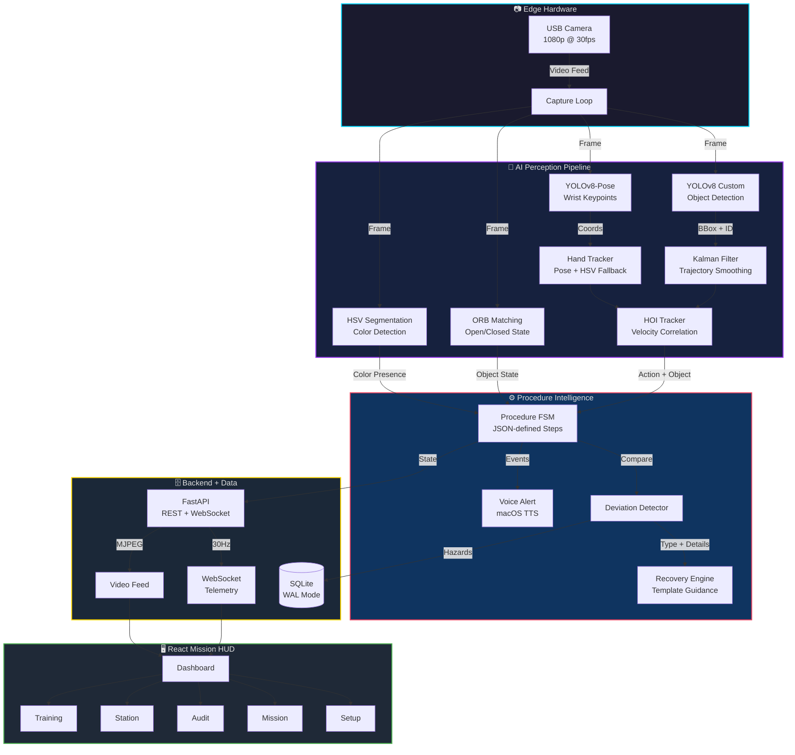


## 🔗 Frontend ↔ Backend ↔ AI

<div align="center">

```
                     ┌────────────────────────────┐
                     │       REACT FRONTEND        │
                     │                            │
                     │  Setup · Mission · Audit   │
                     │  Station · Training        │
                     └─────┬──────────┬───────────┘
                           │          │
                WebSocket  │          │  MJPEG / REST
                 (30 Hz)   │          │
                           ▼          ▼
                     ┌────────────────────────────┐
                     │      FASTAPI BACKEND        │
                     │                            │
                     │  /ws/telemetry/{id}        │
                     │  /video_feed               │
                     │  /api/session/*            │
                     │  /api/procedures/*         │
                     │  /api/objects/*            │
                     │  /api/fsm/*               │
                     │  /api/speak               │
                     └─────┬──────────┬───────────┘
                           │          │
                           ▼          ▼
                ┌─────────────┐  ┌─────────────┐
                │  AI ENGINE   │  │  SQLITE DB  │
                │  (Thread)    │  │  (WAL Mode) │
                │              │  │             │
                │ YOLO + Pose  │  │ Sessions    │
                │ HOI Tracker  │  │ Transitions │
                │ ORB Matching │  │ Hazard Logs │
                │ Kalman       │  │             │
                │ FSM + Voice  │  │             │
                └─────────────┘  └─────────────┘
```

</div>


## 📡 Real-Time Event Flow

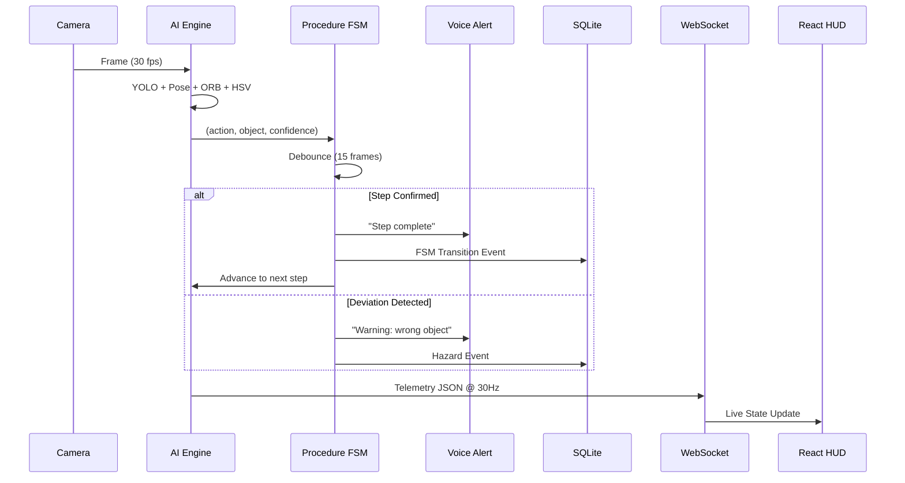


## 🔒 Offline-First Architecture

<div align="center">

```
                        INTERNET
                           ✕
                           │
              ┌────────────▼────────────────────────────────┐
              │                                              │
              │              LOCAL  SYSTEM                   │
              │                                              │
              │   Camera ──► YOLOv8 + Pose (local .pt)      │
              │                ORB + HSV (OpenCV)            │
              │                     │                        │
              │                     ▼                        │
              │             HOI Tracker (scipy)              │
              │             Kalman Filter (OpenCV)           │
              │                     │                        │
              │                     ▼                        │
              │             Procedure FSM (JSON config)      │
              │             Recovery Engine (templates)      │
              │                     │                        │
              │                     ▼                        │
              │             Voice (macOS TTS / pyttsx3)      │
              │             SQLite (WAL, local file)         │
              │                     │                        │
              │                     ▼                        │
              │             FastAPI  ─── localhost:8000      │
              │             React HUD ── localhost:5173      │
              │                                              │
              └──────────────────────────────────────────────┘

           All AI models bundled locally. No API keys.
           No cloud inference. Internet needed only for
           initial npm install / pip install.
```

</div>


## 🛠️ Technology Stack

<div align="center">
  <a href="https://skillicons.dev">
    
  </a>
  
  <br/><br/>
  
  
</div>

<br/>

### 🖥️ Frontend

| Technology | Purpose |
|:---|:---|
| **React 19** | Component-based real-time UI |
| **TypeScript 6** | Type-safe frontend logic |
| **Vite 8** | Fast development server & bundler |
| **TailwindCSS 3.4** | Utility-first styling with Orbitron + JetBrains Mono |
| **Framer Motion** | Micro-animations and transitions |
| **Lucide React** | Icon system |
| **React Router 7** | Client-side page routing |
| **React Virtuoso** | Virtualized lists for telemetry logs |

### ⚙️ Backend

| Technology | Purpose |
|:---|:---|
| **Python 3.10+** | Core runtime language |
| **FastAPI 0.115+** | Async web framework with WebSocket support |
| **Uvicorn** | ASGI server |
| **Pydantic** | Data validation and settings management |
| **structlog** | Structured logging |

### 🔭 AI / Computer Vision

| Technology | Purpose |
|:---|:---|
| **YOLOv8** (Ultralytics) | Object detection + tracking (custom-trained) |
| **YOLOv8-Pose** | Body pose estimation — wrist & elbow keypoints |
| **OpenCV** | ORB features, Kalman filter, HSV, CLAHE, PnP solver |
| **SciPy** | Pearson correlation for HOI velocity matching |
| **NumPy** | Array math for all CV operations |

### 🗄️ Data & Communication

| Technology | Purpose |
|:---|:---|
| **SQLite (WAL)** | Local event database, zero-setup |
| **WebSocket** | 30 Hz telemetry stream to frontend |
| **MJPEG** | Live camera feed to browser |
| **REST API** | Session, procedure, and object management |
| **Protocol Buffers** | Telemetry schema definition |

### 🎙️ Voice

| Technology | Purpose |
|:---|:---|
| **macOS `say`** | Primary TTS — NSSpeechSynthesizer, Daniel voice |
| **pyttsx3** | Cross-platform TTS fallback |


## 🔍 Why These Technologies?

| Choice | Rationale |
|:---|:---|
| **FastAPI** | Native async + WebSocket + Pydantic validation. AI-friendly Python backend that interfaces with YOLO/OpenCV without language boundaries. |
| **React + TS** | Component architecture maps naturally to the multi-panel Mission Control HUD. TypeScript catches schema mismatches at compile time. |
| **YOLOv8 Nano** | Small enough for edge inference on a laptop CPU. Custom-trained on domain-specific objects. |
| **ORB Matching** | YOLO detects *what* an object is; ORB detects *what state* it's in (open vs closed). Works offline, no training needed — just reference images. |
| **Kalman Filter** | Smooths bounding box jitter, provides trajectory prediction during occlusions. Prevents false HOI state transitions. |
| **SQLite WAL** | Zero-setup local DB. WAL mode allows AI engine writes at 30 Hz without blocking API server reads. |
| **JSON Procedures** | Procedures are data, not code. New experiments can be defined without modifying the engine. |
| **Template Recovery** | Recovery instructions are predefined, deterministic, and auditable. Never generated by AI/LLM at runtime. |


## 🎯 Why This Is Not Just a Computer Vision Demo

<div align="center">

```
   ┌──────────────────────┐        ┌──────────────────────────────┐
   │   OBJECT DETECTION   │        │   ACTIVITY UNDERSTANDING     │
   │                      │   ≠    │                              │
   │  "I see a red box"   │        │  "The operator is picking    │
   │                      │        │   up the red box"            │
   └──────────────────────┘        └──────────────────────────────┘

   ┌──────────────────────┐        ┌──────────────────────────────┐
   │ ACTIVITY RECOGNITION │        │   PROCEDURE VERIFICATION     │
   │                      │   ≠    │                              │
   │  "Someone is picking │        │  "Step S02 expects red_box.  │
   │   something up"      │        │   Operator shows yellow_box. │
   │                      │        │   This is WRONG."            │
   └──────────────────────┘        └──────────────────────────────┘

   ┌──────────────────────┐        ┌──────────────────────────────┐
   │     VERIFICATION     │        │   ACTIONABLE ASSISTANCE      │
   │                      │   ≠    │                              │
   │  "This step is wrong"│        │  "Warning. Yellow box is a   │
   │                      │        │   future step. Please show   │
   │                      │        │   the hole puncher."         │
   └──────────────────────┘        └──────────────────────────────┘
```

</div>

**A.T.L.A.S. implements four layers — most CV demos stop at Layer 1:**

```
                    LAYER 1 — PERCEPTION
               (detect, track, measure)
                          │
                          ▼
                 LAYER 2 — UNDERSTANDING
             (identify actions & interactions)
                          │
                          ▼
             LAYER 3 — PROCEDURE INTELLIGENCE
          (verify, detect deviations, recover)
                          │
                          ▼
             LAYER 4 — ACTIONABLE ASSISTANCE
          (voice guidance, UI alerts, logging)
```


## 🧩 Multimodal Evidence

A.T.L.A.S. does **not** verify a step based on a single prediction. Multiple independent signals must converge:

```
     ┌───────────────┐   ┌──────────────┐   ┌────────────────────┐
     │  YOLO Object  │   │  Pose Hand   │   │  ORB / HSV         │
     │  Detection    │   │  Tracking    │   │  Object State      │
     │  ✓ Present    │   │  ✓ Present   │   │  (Open / Closed)   │
     └───────┬───────┘   └──────┬───────┘   └─────────┬──────────┘
             │                  │                      │
             └──────────┬───────┘                      │
                        ▼                              │
             ┌──────────────────────┐                  │
             │  HOI Tracker         │◄─────────────────┘
             │  Velocity Correlation│
             │  (Pearson's r)       │
             └──────────┬───────────┘
                        ▼
             ┌──────────────────────┐
             │  Scene Change        │
             │  Analysis            │
             │  (Frame Differencing)│
             └──────────┬───────────┘
                        ▼
             ┌──────────────────────┐
             │  Temporal Debounce   │
             │  (15 consecutive     │
             │   matching frames)   │
             └──────────┬───────────┘
                        ▼
                  STEP VERIFIED ✅
```

> 🔮 **Future:** Hardware sensor integration (IMU, pressure, temperature) for additional evidence channels. Not currently implemented.


## 📡 Telemetry Schema

A.T.L.A.S. defines its telemetry using **Protocol Buffers**. The WebSocket streams JSON-serialized telemetry at up to 30 Hz:

```protobuf
message TelemetryFrame {
    double timestamp        = 1;
    FSMState fsm_state      = 2;
    repeated Detection detections   = 3;
    repeated Interaction interactions = 4;
    int32 latency_ms        = 5;
    int32 fps               = 6;
}

message Interaction {
    string class_name  = 1;
    string state       = 2;    // "FAR", "NEAR", "HELD"
    float distance_mm  = 3;
}
```

The WebSocket payload extends this with: biometric auth status, ISP settling, hand kinematics, HOI Pearson's r, spatial containment, glare saturation, Kalman coasting, and system health metrics.


## 🎛️ Frontend — Mission Control HUD

The frontend is a **Mission Control HUD** built with React, Vite, TailwindCSS, and aerospace typography (Orbitron & JetBrains Mono).

### Pages

| Page | Purpose |
|:---|:---|
| 🔧 **Setup** | Pre-flight hardware verification — camera status, biometric authentication, safety protocol (bare hands → gloves → eye protection), procedure selection |
| 📊 **Station** | System telemetry — real-time FPS, inference latency, detection counts, hand tracking, WebSocket health, RAM usage |
| 🎯 **Mission** | Live operations — camera feed + AI overlays, FSM progress, current instruction, deviation alerts, evidence metrics, voice-guided execution |
| 📋 **Audit** | Post-experiment review — session timeline, FSM transition log, hazard events, deviation count, video playback |
| 🧪 **Training** | Object registration — capture reference images, register objects via ORB extraction, build custom procedures |

### Pre-Flight Safety Protocol

```
1. 🔐 BIOMETRIC AUTH     →  Face recognition against authorized operators
2. ✋ SAFETY_HAND         →  Bare hand detection via Pose keypoints
3. 🧤 SAFETY_GLOVES      →  White glove detection via brightness analysis
4. 🥽 SAFETY_GLASSES     →  Eye protection verification via Pose eye keypoints
5. ✅ ACCESS GRANTED      →  Mission unlocked
```


## ⚙️ Backend & AI Engine

The core AI engine runs in a **dedicated background thread**, processing frames in a continuous loop. Decoupled from FastAPI via thread-safe shared state (`MissionState`) and an async write queue for database operations.

### Core Engine Components

| Component | File | Function |
|:---|:---|:---|
| 🧠 **AI Engine Loop** | `engine.py` | Main frame loop — YOLO, pose, HOI, FSM, voice, recording |
| ⚙️ **Procedure FSM** | `procedure_fsm.py` | Deterministic state machine — JSON procedures, debouncing, deviations |
| 🤝 **HOI Tracker** | `hoi_tracker.py` | Velocity Correlation (Pearson's r) + metric-space distance |
| ⚠️ **Deviation Detector** | `deviation_detector.py` | Classifies: WRONG_OBJECT, SKIPPED_STEP, WRONG_ORDER |
| 🔄 **Recovery Engine** | `recovery_engine.py` | Template-based UI text + voice guidance |
| 📐 **Kalman Filter** | `kalman_filter.py` | 8-state KF per tracked object for bbox smoothing |
| 🎙️ **Voice Alert** | `voice_alert.py` | Background TTS thread — pyttsx3 / macOS say |
| 📏 **PnP Solver** | `pnp_solver.py` | 6-DoF pose estimation of rigid tools |
| 🔄 **Kinematic Exporter** | `kinematic_exporter.py` | Rotation → Euler angles (pitch, yaw, roll) |
| 🧪 **Protocol Compiler** | `protocol_compiler.py` | *Experimental:* Local LLM (Qwen 0.5B) manual → JSON |
| 📐 **Spatial Checker** | `engine.py` | Containment boundary verification |

### Additional Capabilities

| Feature | Description |
|:---|:---|
| 🔐 **Biometric Auth** | Optional face recognition via `face_recognition` library |
| 🌡️ **Thermal Governor** | Dynamic CPU throttle on fanless hardware — adjusts pose frequency |
| 🔌 **Hardware Watchdog** | Auto-recovers from USB camera bus deadlocks |
| ☀️ **Glare Detection** | V-channel saturation monitoring for optical glare |
| 🚨 **Immobility Detection** | Flags potential crew emergency if hand variance drops |
| 🛸 **Unsecured Drift** | Kalman velocity analysis detects objects moving without being held |
| 🎬 **Video Recording** | Automatic MP4 recording per session for audit replay |
| 📦 **Dynamic Object Registry** | Runtime object registration via ORB — no retraining needed |
| 🌊 **Kinetic Jerk & Slosh Guard** | Physics-based fluid spill mitigation for microgravity handling |
| 🔋 **SWaP-C Eco-Governor** | Autonomous spacecraft power optimization throttling static scenes |
| ⛓️ **Merkle Flight Recorder** | DO-178C compliant tamper-proof hash chain logging for FSM |
| ⏱️ **Cognitive Stall Detector** | Kinematic hesitation tracking triggering TTS operator assistance |
| 🎯 **FOD Vector Projection** | Active collision avoidance with trajectory drawing for drifting items |
| 🛰️ **CCSDS Telemetry** | Deep-space CCSDS Space Packet Protocol (133.0-B-2) formatter |
| 🌐 **WebGL Digital Twin** | Bandwidth-optimized 3D Canvas rendering of the experiment state |


## 🗂️ Repository Structure

<details>
<summary><b>📂 Click to expand full project tree</b></summary>

<br/>

```
A.T.L.A.S/
│
├── 🔧 bas-apg-backend/                    Python backend + AI engine
│   ├── app/
│   │   ├── main.py                         FastAPI application entry point
│   │   ├── core/
│   │   │   ├── engine.py                   Main AI engine loop (~1270 lines)
│   │   │   ├── config.py                   Pydantic settings (env-configurable)
│   │   │   ├── database.py                 SQLite WAL + async write queue
│   │   │   ├── state.py                    Thread-safe shared MissionState
│   │   │   └── logger.py                   Structured logging
│   │   ├── engines/
│   │   │   ├── procedure_fsm.py            Deterministic FSM
│   │   │   ├── hoi_tracker.py              Hand-Object Interaction
│   │   │   ├── deviation_detector.py       Deviation classification
│   │   │   ├── recovery_engine.py          Template recovery guidance
│   │   │   ├── kalman_filter.py            Multi-object Kalman tracker
│   │   │   ├── voice_alert.py              Background TTS worker
│   │   │   ├── pnp_solver.py              PnP pose estimation
│   │   │   ├── kinematic_exporter.py       Euler angle conversion
│   │   │   ├── protocol_compiler.py        Experimental LLM parser
│   │   │   ├── ccsds_formatter.py          CCSDS telemetry bit-packing
│   │   │   ├── merkle_ledger.py            Cryptographic audit hashing
│   │   │   └── crew_tracker.py             Crew proximity and safety tracking
│   │   ├── routers/
│   │   │   ├── stream.py                   WebSocket + MJPEG + auth
│   │   │   ├── session.py                  Session CRUD + audit
│   │   │   ├── object_registry.py          Object capture & registration
│   │   │   └── procedure_builder.py        Procedure CRUD + selection
│   │   └── schemas/
│   │       └── telemetry.proto             Protocol Buffer schema
│   ├── data/
│   │   ├── procedures/                     JSON procedure definitions
│   │   ├── models/                         Custom-trained YOLO weights
│   │   ├── objects/                        Dynamic object reference images
│   │   └── hand_landmarker.task            MediaPipe hand model
│   ├── biometrics/                         Enrolled operator faces
│   ├── scripts/                            Training, eval, calibration
│   └── requirements.txt                    Python dependencies
│
├── 🖥️ bas-apg-frontend/                    React frontend
│   ├── src/
│   │   ├── App.tsx                         Root component + routing
│   │   ├── pages/
│   │   │   ├── Setup.tsx                   Pre-flight diagnostics
│   │   │   ├── Station.tsx                 Telemetry dashboard
│   │   │   ├── Mission.tsx                 Mission control HUD
│   │   │   ├── Audit.tsx                   Post-experiment review
│   │   │   └── Training.tsx               Object registration
│   │   ├── context/                        Global state
│   │   ├── components/                     Reusable UI components
│   │   └── types/                          TypeScript definitions
│   ├── package.json
│   └── vite.config.ts
│
├── 📸 assets/screenshots/                  Dashboard screenshots
├── 📋 experiment_logs/                     Timestamped text logs
├── 🎬 experiment_videos/                   Recorded MP4 sessions
├── 🚀 launch_demo.sh                      One-click launcher
└── 📖 README.md                            You are here
```

</details>


## 🖥️ Demo Workflow

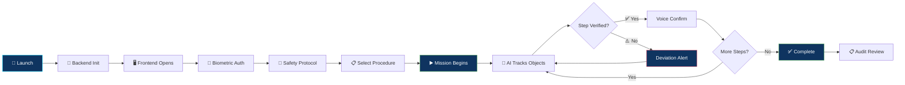


## 🚀 Quick Start

### Prerequisites

| Requirement | Version |
|:---|:---|
| 🐍 Python | 3.10+ with `pip` and `venv` or `conda` |
| 📦 Node.js | 18+ with `npm` |
| 📷 Camera | USB webcam or integrated camera |
| 💻 OS | macOS (primary), Linux, Windows (WSL) |

<details>
<summary><b>📥 1. Clone the Repository</b></summary>

<br/>

```bash
git clone https://github.com/atulharshvardhan2006/ATLAS-FULL-STACK-SIH-26174.git
cd ATLAS-FULL-STACK-SIH-26174
```

</details>

<details>
<summary><b>⚙️ 2. Backend Setup</b></summary>

<br/>

The backend powers YOLOv8, Pose, HOI Tracking, FSM, Voice, and the FastAPI telemetry server.

```bash
cd bas-apg-backend

# Option A: Using venv
python3 -m venv venv
source venv/bin/activate       # macOS/Linux
pip install -r requirements.txt

# Option B: Using conda
conda create -n bas_apg_env python=3.10 -y
conda activate bas_apg_env
pip install -r requirements.txt

# Start the backend
# Models (yolov8n.pt, yolov8n-pose.pt, hand_landmarker.task)
# are bundled locally — no downloads required.
./launch_edge_node.sh
```

> Backend runs on **`localhost:8000`**

</details>

<details>
<summary><b>🖥️ 3. Frontend Setup</b></summary>

<br/>

```bash
cd bas-apg-frontend

# Install dependencies (internet needed only on first install)
npm install

# Start the development server
npm run dev
```

> Frontend runs on **`localhost:5173`**

</details>

<details>
<summary><b>🚀 4. One-Click Launch (macOS/Linux)</b></summary>

<br/>

```bash
chmod +x launch_demo.sh
./launch_demo.sh
```

This will:
- Kill any existing processes on ports 8000 and 5173
- Start the backend with the watchdog runner
- Start the frontend dev server
- Open the browser to Setup and Station pages

</details>


## 🚨 Troubleshooting

| Issue | Solution |
|:---|:---|
| 📷 **Webcam Access Denied** | Enable Camera Privacy Permissions (System Settings → Privacy & Security → Camera on macOS) |
| 🔌 **Port Conflicts** | Ensure ports `8000` and `5173` are free. Launch script auto-kills existing processes. |
| 🐌 **Low FPS** | YOLOv8 falls back to CPU without GPU. Close background apps. Thermal governor auto-throttles when hot. |
| 👤 **`face_recognition` Not Found** | Optional library. Without it, auth auto-grants after delay. Install: `pip install face_recognition` |
| 🔇 **No Voice on Linux** | pyttsx3 requires espeak: `sudo apt install espeak` |


## 📸 Screenshots & Dashboards

### Setup & Pre-Flight Diagnostics
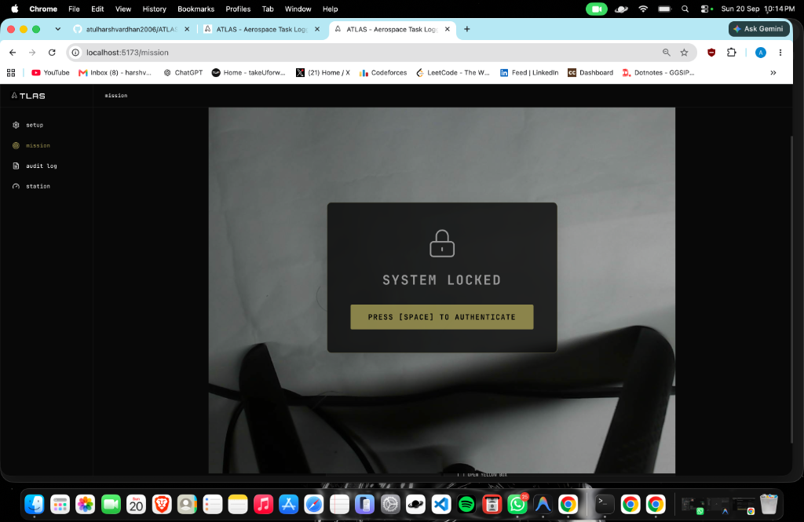

### Station Telemetry
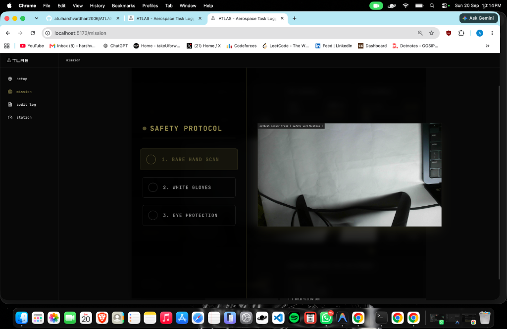

### Mission Control & Live Feed
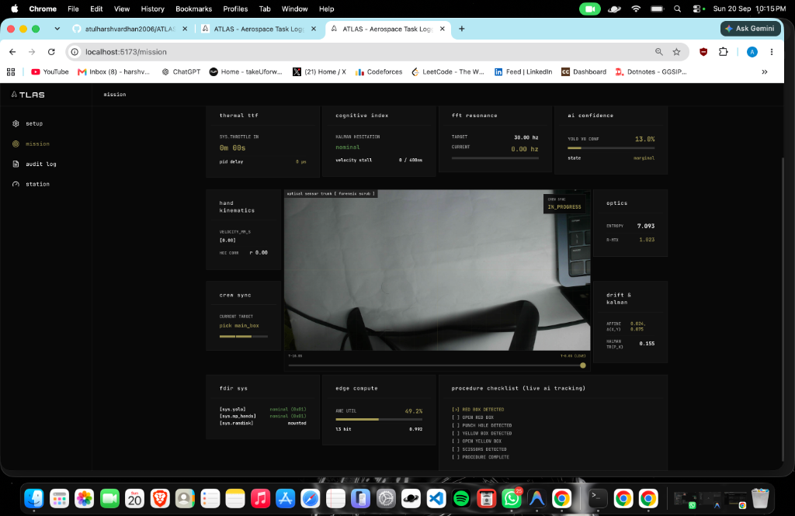
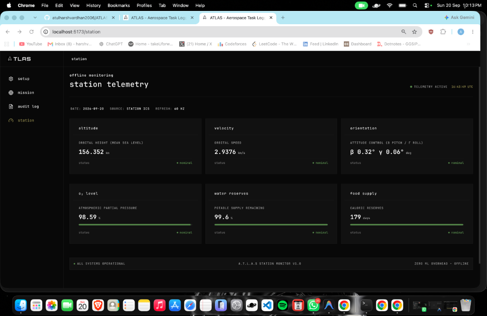
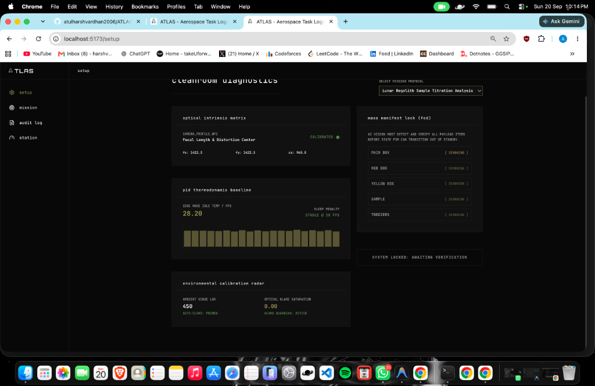

<details>
<summary><b>📸 More Screenshots (click to expand)</b></summary>

<br/>

### Audit & Telemetry Logs
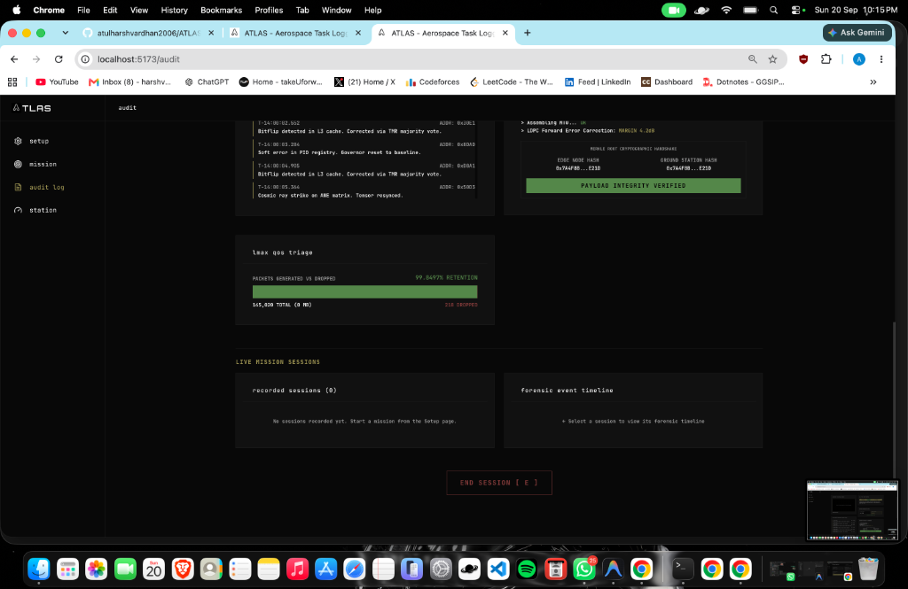
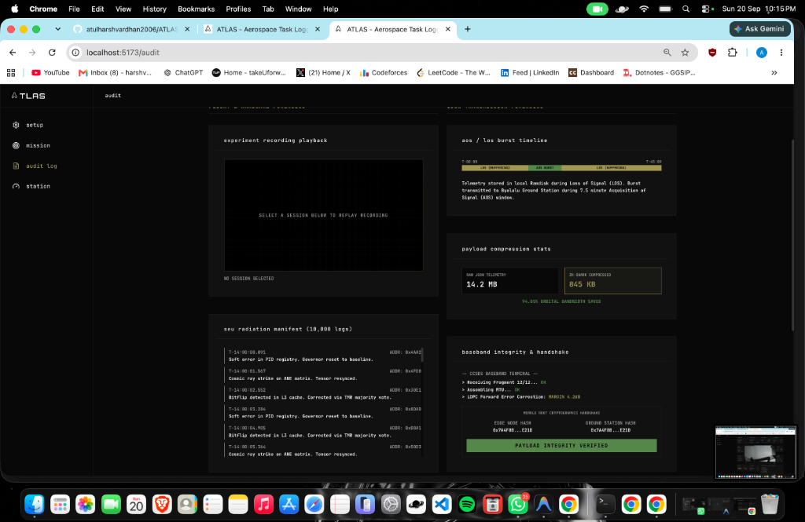

### Training Suite & Object Registration
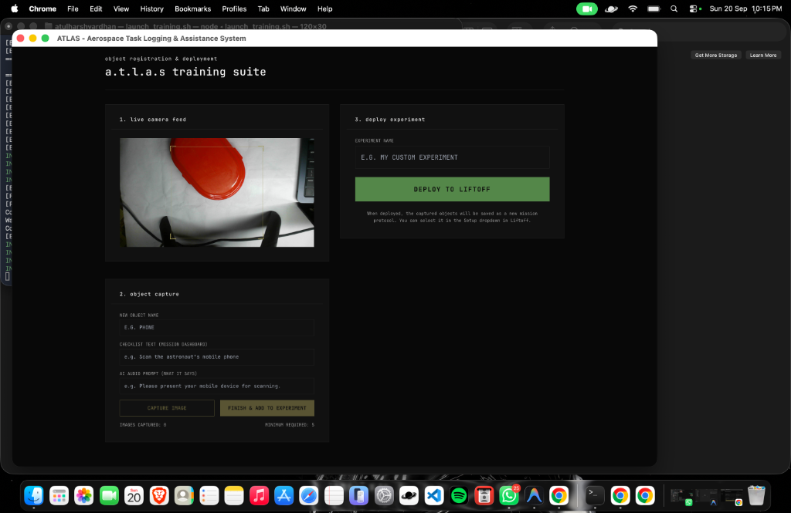

### Local Data Logging & Native Apps
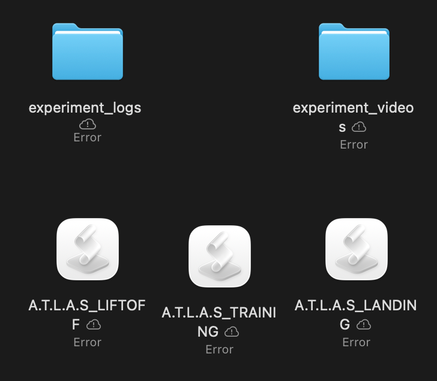

</details>


## 🔐 Safety & Reliability Principles

| Principle | Implementation |
|:---|:---|
| 🔒 **Local Processing** | All AI inference and procedure logic runs locally. No data leaves the device. |
| ⚙️ **Deterministic Logic** | FSM is a pure function — same inputs, same result. No randomness in safety paths. |
| 📋 **Bounded Recovery** | Recovery comes from predefined templates, not AI-generated text. |
| 🔀 **Separation of Concerns** | Protocol Compiler (LLM) is a dev tool — never runs during live experiments. |
| 📊 **Audit Trail** | Every transition, deviation, and hazard recorded with UTC timestamps. |
| 🛡️ **Graceful Degradation** | No face_recognition → auto-grant. Camera drops → watchdog reconnects. CPU hot → governor throttles. |


## 🧭 Differentiation

> Existing systems demonstrate capabilities in crew assistance, computer vision activity monitoring, and onboard experiment support. A.T.L.A.S. focuses on integrating these into a single offline-first prototype:

| Capability | A.T.L.A.S. Approach |
|:---|:---|
| 🔭 Perception | Multi-model (YOLO + Pose + ORB + HSV + Kalman) — not single-model |
| 🤝 Interaction | Velocity Correlation for HOI — not just proximity |
| 📋 Procedure Tracking | JSON-defined FSM with step sequencing — not open-ended classification |
| 🔍 Verification | Multi-signal evidence fusion with temporal debouncing |
| ⚠️ Deviation Handling | Typed classification + template-based recovery |
| 🔒 Architecture | Offline-first edge deployment — not cloud-dependent |


## ⚡ What Makes This Technically Interesting

| Feature | Detail |
|:---|:---|
| 🔄 **Perception → Reasoning** | Pixel-level detection through spatial analysis to procedural verification in a single frame loop |
| 🔍 **Evidence Fusion** | Verification requires convergence of 5+ signals — not a single classifier output |
| 📈 **Velocity Correlation** | Pearson's r between hand/object velocity vectors for grasp detection |
| 📦 **Dynamic Objects** | Runtime registration via ORB extraction — no retraining |
| ⚡ **Zero-Copy Telemetry** | AI writes atomic refs (GIL), WebSocket reads same state, DB via async queue — 30 Hz never blocks |
| 📋 **Procedure-as-Data** | Experiments are JSON files. Same engine runs any procedure. Protocol Compiler generates definitions from plain text. |


## ⚠️ Known Limitations

| Limitation | Details |
|:---|:---|
| 🏠 Controlled Environment | Tested in well-lit, tabletop demo. Variable lighting/backgrounds not extensively evaluated. |
| 📦 Limited Object Classes | Custom YOLO trained on small set (colored boxes, hole puncher, scissors). |
| 📏 Monocular Depth | Uses apparent size — true 3D requires stereo/depth sensors. |
| 🫣 Occlusion | Heavy hand-over-object occlusion degrades tracking despite Kalman coasting. |
| 👤 Single Operator | Pipeline optimized for one operator. Multi-person not handled. |
| 🛸 Microgravity | All testing in 1g. Assumptions may need adjustment for microgravity. |
| 🔎 ORB Sensitivity | Open/closed detection sensitive to viewpoint and lighting changes. |
| 📡 Vision-Only | No hardware sensors. Physical sensor integration not yet implemented. |


## 🗺️ Future Roadmap

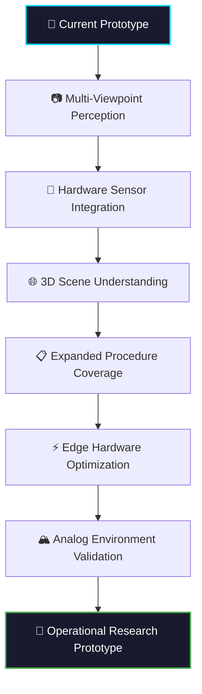


## 🔬 Research Directions

> *The following are areas of potential exploration — not currently implemented:*

| Direction | Description |
|:---|:---|
| 🧍 3D Human Mesh Recovery | Precise hand pose under occlusion |
| 📐 Payload-Relative Reasoning | ArUco markers or SLAM for spatial reference |
| 🎬 Temporal Activity Recognition | Action transformers instead of frame-level classification |
| 📊 Uncertainty Estimation | Epistemic vs aleatoric uncertainty in verification |
| ⚡ Edge Optimization | ONNX quantization, TensorRT, Apple Neural Engine |
| 🔄 Experiment Replay | Annotated timeline visualization |
| 💡 Explainable Evidence | Show *why* a step was verified or flagged |
| 📡 Multi-Modal Fusion | Non-vision signals in the evidence pipeline |


## 🧪 Testing

| Test Type | Location | Description |
|:---|:---|:---|
| 🔌 Backend Integration | `scripts/test_backend.py` | FastAPI endpoints, session CRUD, WebSocket |
| 📊 Model Evaluation | `scripts/evaluate_model.py` | YOLO performance on validation set |
| ✅ Phase Verification | `scripts/verify_phase1.py`, `verify_phase2.py` | Component-level checks |
| 🌡️ Hardware Profiling | `scripts/profile_hardware.py` | CPU/memory/thermal benchmarks |
| 📷 Camera Calibration | `scripts/calibrate_camera.py` | Intrinsic matrix from checkerboard |


## 🤝 Contributing

Contributions welcome! Key areas:

- 📸 Additional YOLO training data for experiment objects
- 🐧 Cross-platform testing (Linux GPU, Windows WSL)
- 📋 New procedure definitions for different experiments
- ⚡ Edge optimization and quantization
- 📡 Additional evidence signals and sensor integration


## 📜 Acknowledgements

<div align="center">

**Smart India Hackathon 2026** — Problem Statement SIH26174

**Organization:** ISRO · **Domain:** AI Human Activity Recognition for On-board BAS Experiments

<br/>

Built with open-source technologies:

[Ultralytics YOLOv8](https://github.com/ultralytics/ultralytics) · [FastAPI](https://fastapi.tiangolo.com/) · [React](https://react.dev/) · [OpenCV](https://opencv.org/) · [SciPy](https://scipy.org/)

<br/>

---

<br/>

> **A.T.L.A.S. is built around a simple idea:**
>
> *An experiment-monitoring system should not only see what is happening — it should understand what is expected, evaluate the evidence, identify deviations, and help the operator recover.*

<br/>


<br/>
<br/>


</div>
